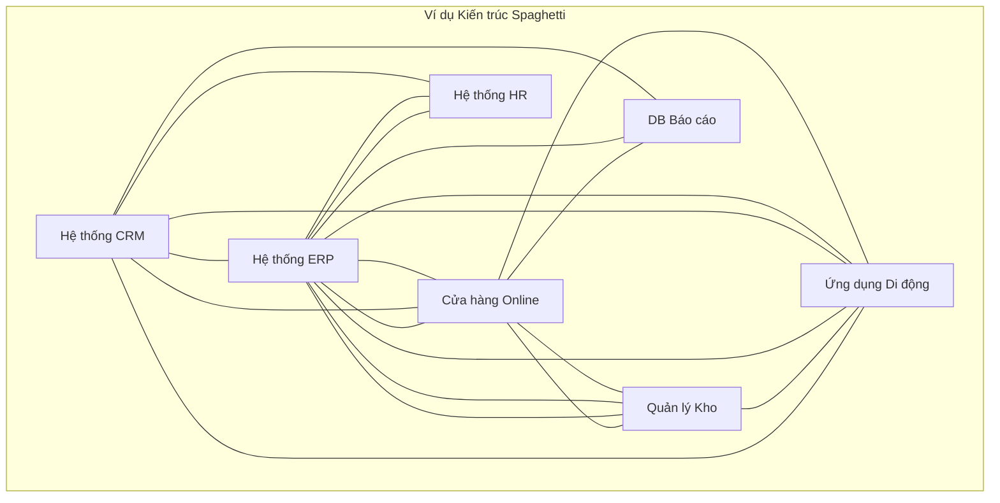
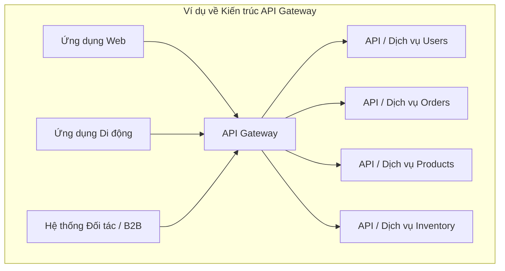

Xin chào mọi người và chào mừng đến với bài viết đầu tiên trong loạt bài hướng dẫn MuleSoft! Là một lập trình viên MuleSoft và phụ trách tích hợp dữ liệu giữa các hệ thống, tôi thường thấy các công ty gặp khó khăn trong việc kết nối ngày càng nhiều ứng dụng của họ. Nếu bạn mới làm quen với tích hợp hoặc tò mò về MuleSoft, bạn đã đến đúng nơi. Hãy bắt đầu với một câu chuyện quen thuộc.

## Những Khó Khăn Phát Triển: Vấn Đề Tích Hợp của Acme Corp

Hãy tưởng tượng một công ty, gọi là "Acme Corp". Họ bắt đầu mới quy mô nhỏ, có thể chỉ với một hệ thống quản lý kho hàng và một cửa hàng trực tuyến đơn giản. Cuộc sống thật tốt đẹp. Nhưng khi Acme phát triển, họ thêm nhiều phần mềm: CRM cho bán hàng, ERP cho tài chính, hệ thống HR chuyên dụng, có thể là một ứng dụng di động... nghe rất quen thuộc phải không?

Mỗi khi một hệ thống mới xuất hiện, họ cần nó giao tiếp với các hệ thống khác. "Chúng ta cần dữ liệu khách hàng từ CRM trong ERP!" hoặc "Đồng bộ hóa kho từ ERP đến cửa hàng trực tuyến!" Vì vậy, các lập trình viên đã làm điều có vẻ hợp lý: họ xây dựng các kết nối trực tiếp. CRM nói chuyện với ERP. ERP nói chuyện với cửa hàng. Cửa hàng nói chuyện với hệ thống kho. Ứng dụng di động nói chuyện với *mọi thứ*.

Ban đầu, **tích hợp point-to-point** này hoạt động tốt. Nhưng sớm thôi, cảnh quan IT của Acme trông như thế này:

Như các bạn thấy ở trên, được gọi một cách thân thiện (hoặc đầy bực tức) là **Kiến trúc Spaghetti**.

### Tại Sao Kiến trúc Spaghetti Khiến Bạn Khó Chịu

Mặc dù các kết nối trực tiếp có vẻ đơn giản lúc đầu, cách tiếp cận này nhanh chóng trở thành một cơn ác mộng:

* **Phức tạp:** Mỗi hệ thống mới tiềm ẩn yêu cầu kết nối với nhiều hệ thống hiện có. Số lượng kết nối tăng vọt! Quản lý và hiểu mạng lưới này trở nên cực kỳ khó khăn.
* **Dễ vỡ:** Nếu một hệ thống thay đổi định dạng dữ liệu hoặc API, *mọi hệ thống* kết nối trực tiếp với nó đều cần sửa đổi. Một thay đổi nhỏ có thể gây ra hàng loạt lỗi. Bảo trì tốn kém và chậm chạp.
* **Khó Tái sử dụng:** Logic để kết nối với một hệ thống cụ thể (ví dụ: lấy dữ liệu khách hàng) có thể bị lặp lại ở nhiều nơi.
* **Khó Mở rộng:** Thêm hệ thống mới hoặc mở rộng hệ thống hiện có trở thành một dự án lớn liên quan đến việc gỡ rối và kết nối lại.
* **Thiếu Khả năng Quan sát:** Hiểu luồng dữ liệu trong toàn tổ chức gần như không thể. Khắc phục sự cố giống như tìm một sợi mì cụ thể trong tô spaghetti.

Acme Corp nhận ra họ cần một cách tốt hơn. Họ cần **middleware**.

## Cảnh sát Giao thông: Enterprise Service Bus (ESB)

Để giải quyết mớ hỗn độn của spaghetti, khái niệm **Enterprise Service Bus (ESB)** ra đời. Hãy nghĩ về ESB như một "xương sống" trung tâm hoặc một "bus" middleware mà các ứng dụng cắm vào, thay vì nói chuyện trực tiếp với nhau.

### Khái niệm ESB

* **Trung gian:** ESB có thể chuyển đổi định dạng dữ liệu giữa các hệ thống khác nhau (ví dụ: XML sang JSON).
* **Định tuyến:** Nó chuyển hướng tin nhắn từ hệ thống nguồn đến (các) hệ thống đích chính xác.
* **Chuyển đổi Giao thức:** Nó có thể xử lý giao tiếp giữa các hệ thống sử dụng các giao thức khác nhau (ví dụ: HTTP sang JMS).
* **Tập trung hóa:** Cung cấp một điểm duy nhất để quản lý và giám sát tích hợp.

### Điểm mạnh của ESB

* **Tách rời:** Các hệ thống không cần biết chi tiết cụ thể (vị trí, giao thức, định dạng dữ liệu) của hệ thống khác. Chúng chỉ nói chuyện với ESB.
* **Tái sử dụng:** Logic tích hợp phổ biến (như chuyển đổi dữ liệu hoặc xác thực) thường có thể được tích hợp vào ESB và tái sử dụng.
* **Cải thiện Khả năng Bảo trì:** Thay đổi trong một hệ thống ít có khả năng ảnh hưởng đến các hệ thống khác, vì ESB xử lý trung gian.

### Điểm yếu của ESB

* **Tiềm ẩn Nút thắt cổ chai:** Nếu không được thiết kế đúng cách, ESB trung tâm có thể trở thành nút thắt cổ chai về hiệu suất.
* **Phức tạp:** Triển khai và quản lý một ESB đầy đủ tính năng có thể phức tạp.
* **Phụ thuộc vào Nhà cung cấp:** ESB truyền thống đôi khi có thể dẫn đến sự phụ thuộc vào công nghệ của một nhà cung cấp cụ thể.
* **Không Luôn Tập trung vào API:** Mặc dù ESB có thể cung cấp dịch vụ, trọng tâm chính của chúng thường là tích hợp hệ thống-đến-hệ thống nội bộ, không nhất thiết là quản lý API hiện đại, hướng ra bên ngoài.

## Người Gác cổng: API Gateway

Khi API (Application Programming Interfaces) trở thành cách tiêu chuẩn để các ứng dụng giao tiếp, đặc biệt là qua web và di động, một phần middleware khác nổi lên: **API Gateway**.

Hãy nghĩ về API Gateway như một điểm vào chuyên biệt *đặc biệt cho việc quản lý API*. Nó nằm trước các dịch vụ backend hoặc API của bạn và hoạt động như một người gác cổng và quản lý giao thông cho các khách hàng bên ngoài (và đôi khi là nội bộ).

### Khái niệm API Gateway

* **Phơi API:** Phơi bày các dịch vụ backend dưới dạng các API được quản lý.
* **Thực thi Bảo mật:** Xử lý xác thực, ủy quyền, giới hạn tốc độ và các chính sách bảo mật khác.
* **Quản lý Giao thông:** Cân bằng tải, chuyển đổi yêu cầu/phản hồi, bộ nhớ đệm.
* **Giám sát & Phân tích:** Thu thập nhật ký và số liệu về việc sử dụng API.

### ESB vs. API Gateway: Có gì khác?

Mặc dù có sự chồng chéo, trọng tâm của chúng khác nhau:

* **ESB:** Chủ yếu tập trung vào **tích hợp các hệ thống nội bộ đa dạng** sử dụng các giao thức và định dạng dữ liệu khác nhau. Thường liên quan đến logic điều phối và trung gian phức tạp *trong* bus. 
* **API Gateway:** Chủ yếu tập trung vào **quản lý, bảo mật và phơi bày API** (thường là REST hoặc SOAP) cho *người tiêu dùng* bên ngoài hoặc nội bộ. Hoạt động như một mặt tiền hoặc proxy ngược cho các dịch vụ backend.

Một công cụ có thể làm cả hai không? Có, các nền tảng tích hợp hiện đại thường làm mờ ranh giới này.

## Chọn Công cụ của Bạn: Bối cảnh ESB vs. API Gateway

Khi nào nên sử dụng cái nào?

* **Xem xét cách tiếp cận ESB khi:** Thách thức chính của bạn là tích hợp nhiều hệ thống legacy hoặc đa dạng nội bộ với các giao thức khác nhau và nhu cầu định tuyến/chuyển đổi phức tạp. (Ví dụ: IBM Integration Bus, Oracle Service Bus, các phiên bản cũ của Mule ESB thường được sử dụng ở đây).
* **Xem xét API Gateway khi:** Mục tiêu chính của bạn là phơi bày các dịch vụ backend dưới dạng API được quản lý, bảo mật chúng, xử lý giao thông từ khách hàng web/di động và thu thập thông tin về việc sử dụng API. (Ví dụ: Kong, Apigee (Google), AWS API Gateway, Azure API Management).

**Lưu ý Quan trọng:** Nhiều nền tảng hiện đại cung cấp khả năng trải rộng cả hai lĩnh vực.

## Giới thiệu MuleSoft: Nền tảng Tích hợp Thống nhất

Vậy, **MuleSoft** phù hợp như thế nào trong tất cả điều này?

**MuleSoft là gì?**

MuleSoft, hiện là một phần của Salesforce, cung cấp **Anypoint Platform**, một **nền tảng tích hợp thống nhất** hàng đầu. Nó được thiết kế để kết nối *bất kỳ* ứng dụng, nguồn dữ liệu hoặc thiết bị nào, dù ở trên cloud hay tại chỗ.

**MuleSoft Hoạt động Như thế nào?**

MuleSoft kết hợp khả năng của cả ESB truyền thống và API Gateway hiện đại, được xây dựng trên khái niệm **kết nối dựa trên API**. Thay vì chỉ điểm-đến-điểm hoặc một ESB nguyên khối, MuleSoft khuyến khích xây dựng các API có thể tái sử dụng để mở khóa dữ liệu và khả năng trong toàn tổ chức.

Nó hoạt động như:

* Một **ESB:** Cho tích hợp hệ thống nội bộ phức tạp, chuyển đổi dữ liệu (sử dụng ngôn ngữ DataWeave mạnh mẽ) và kết nối các hệ thống legacy.
* Một **API Gateway:** Cho việc thiết kế, xây dựng, bảo mật, quản lý và phân tích API.

**Các Thành phần Chính (Xem nhanh):**

* **Anypoint Platform:** Giao diện web thống nhất để quản lý mọi thứ.
* **Anypoint Studio:** IDE máy tính để thiết kế và xây dựng tích hợp (ứng dụng Mule).
* **Mule Runtime Engine:** Động cơ nhẹ chạy các ứng dụng Mule của bạn.
* **Connectors:** Các connector được xây dựng sẵn cho hàng trăm hệ thống và giao thức (cơ sở dữ liệu, ứng dụng SaaS, hàng đợi tin nhắn, v.v.).
* **API Manager:** Quản lý và bảo mật API của bạn.
* **Anypoint Exchange:** Một thị trường để khám phá và chia sẻ tài nguyên có thể tái sử dụng như API và connector.

Mục tiêu của MuleSoft là làm cho tích hợp dễ dàng và nhanh chóng hơn, chuyển từ các kết nối dễ vỡ sang một mạng lưới API linh hoạt có thể tái sử dụng.

## Kết thúc Phần 1

Chúng ta đã hành trình từ sự hỗn loạn của kiến trúc spaghetti, qua các cách tiếp cận có cấu trúc của ESB và API Gateway, và đến với tầm nhìn tích hợp thống nhất của MuleSoft. Hiểu được sự tiến hóa này là chìa khóa để đánh giá *tại sao* MuleSoft là một công cụ mạnh mẽ trong thế giới kết nối ngày nay.

Trong bài viết tiếp theo, chúng ta sẽ bắt tay vào thực hành! Chúng ta sẽ tìm hiểu về **Thiết lập Môi trường Phát triển MuleSoft**, bao gồm cài đặt Anypoint Studio.

**Có câu hỏi? Suy nghĩ? Chia sẻ chúng trong phần bình luận bên dưới!** Bạn đã gặp những thách thức tích hợp lớn nhất nào?

---