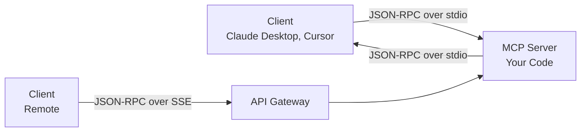

MCP servers are the hot new infrastructure. Every week there's a new one: GitHub MCP, Figma MCP, PostgreSQL MCP, Playwright MCP. But most developers use them. Few build them.

This series changes that.

Over 5 posts, you'll build a production-grade MCP server from absolute zero. Not a weather demo — a real server that does something useful. Each post ends with running code. By day 5, you'll have a deployed, authenticated MCP server that you can plug into Claude Desktop, Cursor, or any MCP client.

---

## What We're Building

A **GitHub Issue Manager MCP server** that an AI agent can use to:

- List issues in a repository
- Create issues with labels and assignees
- Search issues by query
- Get issue details and comments
- Update issue status

Why this? Because every developer needs it, and it's complex enough to demonstrate all three MCP capabilities: **Tools**, **Resources**, and **Prompts**.

---

## Prerequisites

- Node.js 18+ and `npm` installed
- TypeScript basics
- A GitHub personal access token (fine-grained, `issues:read`, `issues:write`)
- A terminal

That's it. No prior MCP experience needed.

---

## Part 1: Understanding the MCP Architecture

Before writing code, understand what we're building.

### The Protocol

MCP is built on **JSON-RPC 2.0** — a lightweight protocol where the client sends requests and the server responds. Messages flow over a transport. The two standard transports are:



### Three Capabilities

An MCP server can expose three things:

| Capability | Analogy | JSON-RPC Method |
|-----------|---------|----------------|
| **Tools** | Functions the LLM can call | `tools/call` |
| **Resources** | Data the LLM can read | `resources/read` |
| **Prompts** | Templates the user can invoke | `prompts/get` |

### Server Lifecycle

```
1. Client starts server process (or connects via SSE)
2. Client sends `initialize` → server responds with capabilities
3. Client sends `initialized` notification
4. Client sends `tools/list` → server responds with tool list
5. Client sends `tools/call` with tool name + args → server executes
6. Client terminates → server shuts down
```

That's the protocol. You don't need to implement it manually — the SDK handles JSON-RPC. But understanding it helps when things go wrong.

---

## Part 2: Project Setup

### Step 1: Create the project

```bash
# Create project directory
mkdir github-issue-mcp
cd github-issue-mcp

# Initialize npm
npm init -y

# Install the MCP SDK and dependencies
npm install @modelcontextprotocol/sdk zod
npm install -D typescript @types/node

# Create source directory
mkdir src
```

### Step 2: Configure TypeScript

Create `tsconfig.json`:

```json
{
  "compilerOptions": {
    "target": "ES2022",
    "module": "Node16",
    "moduleResolution": "Node16",
    "outDir": "./build",
    "rootDir": "./src",
    "strict": true,
    "esModuleInterop": true,
    "skipLibCheck": true,
    "forceConsistentCasingInFileNames": true,
    "resolveJsonModule": true,
    "declaration": true
  },
  "include": ["src/**/*"],
  "exclude": ["node_modules", "build"]
}
```

### Step 3: Update package.json

```json
{
  "name": "github-issue-mcp",
  "version": "1.0.0",
  "type": "module",
  "bin": {
    "github-issue-mcp": "./build/index.js"
  },
  "scripts": {
    "build": "tsc",
    "start": "node build/index.js",
    "dev": "tsc --watch"
  },
  "files": ["build"]
}
```

---

## Part 3: Writing the Server

### Step 4: The entry point

Create `src/index.ts`:

```typescript
import { McpServer } from "@modelcontextprotocol/sdk/server/mcp.js";
import { StdioServerTransport } from "@modelcontextprotocol/sdk/server/stdio.js";

// Create the MCP server instance
const server = new McpServer({
  name: "github-issue-manager",
  version: "1.0.0",
});

async function main() {
  const transport = new StdioServerTransport();
  await server.connect(transport);
  console.error("GitHub Issue Manager MCP Server running on stdio");
}

main().catch((error) => {
  console.error("Fatal error:", error);
  process.exit(1);
});
```

**Critical:** Notice `console.error()` not `console.log()`. For stdio servers, stdout carries the JSON-RPC protocol. Writing to stdout breaks everything. Always use `console.error()` or a logging library configured to stderr.

### Step 5: Add the GitHub client

Create `src/github-client.ts`:

```typescript
const GITHUB_API_BASE = "https://api.github.com";

export interface GitHubIssue {
  number: number;
  title: string;
  state: "open" | "closed";
  body: string | null;
  labels: { name: string; color: string }[];
  assignees: { login: string }[];
  created_at: string;
  updated_at: string;
  html_url: string;
  user: { login: string };
  comments: number;
}

export interface CreateIssueInput {
  title: string;
  body?: string;
  labels?: string[];
  assignees?: string[];
}

export interface UpdateIssueInput {
  title?: string;
  body?: string;
  state?: "open" | "closed";
  labels?: string[];
  assignees?: string[];
}

export interface SearchResult {
  issues: GitHubIssue[];
  total_count: number;
}

export class GitHubClient {
  private token: string;
  private headers: Record<string, string>;

  constructor(token: string) {
    this.token = token;
    this.headers = {
      Authorization: `Bearer ${token}`,
      Accept: "application/vnd.github+json",
      "User-Agent": "github-issue-mcp-server/1.0",
      "X-GitHub-Api-Version": "2022-11-28",
    };
  }

  // GET request
  private async get<T>(url: string): Promise<T> {
    const response = await fetch(url, { headers: this.headers });
    if (!response.ok) {
      throw new Error(`GitHub API error: ${response.status} ${response.statusText}`);
    }
    return response.json() as Promise<T>;
  }

  // POST request
  private async post<T>(url: string, body: unknown): Promise<T> {
    const response = await fetch(url, {
      method: "POST",
      headers: { ...this.headers, "Content-Type": "application/json" },
      body: JSON.stringify(body),
    });
    if (!response.ok) {
      const errorBody = await response.text();
      throw new Error(`GitHub API error ${response.status}: ${errorBody}`);
    }
    return response.json() as Promise<T>;
  }

  // PATCH request
  private async patch<T>(url: string, body: unknown): Promise<T> {
    const response = await fetch(url, {
      method: "PATCH",
      headers: { ...this.headers, "Content-Type": "application/json" },
      body: JSON.stringify(body),
    });
    if (!response.ok) {
      const errorBody = await response.text();
      throw new Error(`GitHub API error ${response.status}: ${errorBody}`);
    }
    return response.json() as Promise<T>;
  }

  // Get issues for a repository
  async listIssues(owner: string, repo: string, state: "open" | "closed" | "all" = "open", limit = 20): Promise<GitHubIssue[]> {
    const url = `${GITHUB_API_BASE}/repos/${owner}/${repo}/issues?state=${state}&per_page=${limit}&sort=updated&direction=desc`;
    const data = await this.get<GitHubIssue[]>(url);
    return data;
  }

  // Create an issue
  async createIssue(owner: string, repo: string, input: CreateIssueInput): Promise<GitHubIssue> {
    const url = `${GITHUB_API_BASE}/repos/${owner}/${repo}/issues`;
    return this.post<GitHubIssue>(url, input);
  }

  // Get a single issue
  async getIssue(owner: string, repo: string, issueNumber: number): Promise<GitHubIssue> {
    const url = `${GITHUB_API_BASE}/repos/${owner}/${repo}/issues/${issueNumber}`;
    return this.get<GitHubIssue>(url);
  }

  // Update an issue
  async updateIssue(owner: string, repo: string, issueNumber: number, input: UpdateIssueInput): Promise<GitHubIssue> {
    const url = `${GITHUB_API_BASE}/repos/${owner}/${repo}/issues/${issueNumber}`;
    return this.patch<GitHubIssue>(url, input);
  }

  // Search issues
  async searchIssues(query: string, limit = 10): Promise<SearchResult> {
    const url = `${GITHUB_API_BASE}/search/issues?q=${encodeURIComponent(query)}&per_page=${limit}`;
    const data = await this.get<{ items: GitHubIssue[]; total_count: number }>(url);
    return { issues: data.items, total_count: data.total_count };
  }
}
```

### Step 6: Register the tools

Back in `src/index.ts`, add the tool registrations:

```typescript
import { McpServer } from "@modelcontextprotocol/sdk/server/mcp.js";
import { StdioServerTransport } from "@modelcontextprotocol/sdk/server/stdio.js";
import { z } from "zod";
import { GitHubClient } from "./github-client.js";

// Initialize
const GITHUB_TOKEN = process.env.GITHUB_TOKEN;
if (!GITHUB_TOKEN) {
  console.error("GITHUB_TOKEN environment variable is required");
  process.exit(1);
}

const server = new McpServer({
  name: "github-issue-manager",
  version: "1.0.0",
});

const github = new GitHubClient(GITHUB_TOKEN);

// ============================================================
// Tool 1: List issues in a repository
// ============================================================
server.tool(
  "list_issues",
  "List issues from a GitHub repository, filtered by state",
  {
    owner: z.string().describe("Repository owner (user or organization)"),
    repo: z.string().describe("Repository name"),
    state: z.enum(["open", "closed", "all"]).default("open").describe("Issue state filter"),
    limit: z.number().min(1).max(100).default(20).describe("Maximum issues to return"),
  },
  async ({ owner, repo, state, limit }) => {
    try {
      const issues = await github.listIssues(owner, repo, state, limit);

      if (issues.length === 0) {
        return {
          content: [{ type: "text", text: `No ${state} issues found in ${owner}/${repo}.` }],
        };
      }

      const formatted = issues.map((issue) => {
        const labels = issue.labels.map((l) => `[${l.name}]`).join(" ");
        const assignees = issue.assignees.map((a) => `@${a.login}`).join(", ");
        return [
          `#${issue.number}: ${issue.title}`,
          `  State: ${issue.state} | Created: ${issue.created_at.slice(0, 10)} | Comments: ${issue.comments}`,
          `  Labels: ${labels || "(none)"}`,
          `  Assignees: ${assignees || "(none)"}`,
          `  URL: ${issue.html_url}`,
        ].join("\n");
      });

      return {
        content: [
          {
            type: "text",
            text: `## Issues in ${owner}/${repo} (${state})\n\n${formatted.join("\n\n")}`,
          },
        ],
      };
    } catch (error) {
      return {
        content: [{ type: "text", text: `Error listing issues: ${error}` }],
        isError: true,
      };
    }
  },
);

// ============================================================
// Tool 2: Get issue details
// ============================================================
server.tool(
  "get_issue",
  "Get detailed information about a single GitHub issue",
  {
    owner: z.string().describe("Repository owner"),
    repo: z.string().describe("Repository name"),
    issue_number: z.number().int().positive().describe("Issue number"),
  },
  async ({ owner, repo, issue_number }) => {
    try {
      const issue = await github.getIssue(owner, repo, issue_number);

      const labels = issue.labels.map((l) => `[${l.name}]`).join(" ");
      const assignees = issue.assignees.map((a) => `@${a.login}`).join(", ");

      const details = [
        `# ${issue.title}`,
        `**Issue #${issue.number}** | **State:** ${issue.state}`,
        `**Author:** @${issue.user.login} | **Created:** ${issue.created_at} | **Updated:** ${issue.updated_at}`,
        `**Labels:** ${labels || "(none)"}`,
        `**Assignees:** ${assignees || "(none)"}`,
        `**Comments:** ${issue.comments}`,
        `**URL:** ${issue.html_url}`,
        "",
        `---`,
        issue.body || "*No description provided*",
      ].join("\n");

      return {
        content: [{ type: "text", text: details }],
      };
    } catch (error) {
      return {
        content: [{ type: "text", text: `Error fetching issue: ${error}` }],
        isError: true,
      };
    }
  },
);

// ============================================================
// Tool 3: Create an issue
// ============================================================
server.tool(
  "create_issue",
  "Create a new issue in a GitHub repository",
  {
    owner: z.string().describe("Repository owner"),
    repo: z.string().describe("Repository name"),
    title: z.string().min(1).max(256).describe("Issue title"),
    body: z.string().optional().describe("Issue body/description (Markdown)"),
    labels: z.array(z.string()).optional().describe("Labels to apply"),
    assignees: z.array(z.string()).optional().describe("Usernames to assign"),
  },
  async ({ owner, repo, title, body, labels, assignees }) => {
    try {
      const issue = await github.createIssue(owner, repo, {
        title,
        body,
        labels,
        assignees,
      });

      return {
        content: [
          {
            type: "text",
            text: [
              `✅ Issue created successfully!`,
              `**#${issue.number}:** ${issue.title}`,
              `**URL:** ${issue.html_url}`,
            ].join("\n"),
          },
        ],
      };
    } catch (error) {
      return {
        content: [{ type: "text", text: `Error creating issue: ${error}` }],
        isError: true,
      };
    }
  },
);

// ============================================================
// Tool 4: Update an issue
// ============================================================
server.tool(
  "update_issue",
  "Update an existing issue (change title, body, labels, assignees, or close)",
  {
    owner: z.string().describe("Repository owner"),
    repo: z.string().describe("Repository name"),
    issue_number: z.number().int().positive().describe("Issue number to update"),
    title: z.string().max(256).optional().describe("New title"),
    body: z.string().optional().describe("New body"),
    state: z.enum(["open", "closed"]).optional().describe("New state"),
    labels: z.array(z.string()).optional().describe("New labels"),
    assignees: z.array(z.string()).optional().describe("New assignees"),
  },
  async ({ owner, repo, issue_number, title, body, state, labels, assignees }) => {
    try {
      const issue = await github.updateIssue(owner, repo, issue_number, {
        title,
        body,
        state,
        labels,
        assignees,
      });

      return {
        content: [
          {
            type: "text",
            text: [
              `✅ Issue #${issue_number} updated!`,
              `**#${issue.number}:** ${issue.title}`,
              `**State:** ${issue.state}`,
              `**URL:** ${issue.html_url}`,
            ].join("\n"),
          },
        ],
      };
    } catch (error) {
      return {
        content: [{ type: "text", text: `Error updating issue: ${error}` }],
        isError: true,
      };
    }
  },
);

// ============================================================
// Tool 5: Search issues
// ============================================================
server.tool(
  "search_issues",
  "Search GitHub issues across repositories using a query",
  {
    query: z.string().min(1).describe("Search query (supports GitHub search syntax like repo:owner/name is:open)"),
    limit: z.number().min(1).max(50).default(10).describe("Maximum results"),
  },
  async ({ query, limit }) => {
    try {
      const result = await github.searchIssues(query, limit);

      if (result.issues.length === 0) {
        return {
          content: [{ type: "text", text: `No issues found for query: "${query}"` }],
        };
      }

      const formatted = result.issues.map((issue) => {
        // Extract repo info from URL: https://github.com/owner/repo/issues/N
        const repoHint = issue.html_url.replace("https://github.com/", "").replace(/\/issues\/\d+/, "");
        return [
          `#${issue.number} (${repoHint}): ${issue.title}`,
          `  State: ${issue.state} | Updated: ${issue.updated_at.slice(0, 10)}`,
          `  URL: ${issue.html_url}`,
        ].join("\n");
      });

      return {
        content: [
          {
            type: "text",
            text: `## Search Results (${result.total_count} total)\n\n${formatted.join("\n\n")}`,
          },
        ],
      };
    } catch (error) {
      return {
        content: [{ type: "text", text: `Error searching issues: ${error}` }],
        isError: true,
      };
    }
  },
);

// ============================================================
// Main
// ============================================================
async function main() {
  const transport = new StdioServerTransport();
  await server.connect(transport);
  console.error("✅ GitHub Issue Manager MCP Server running on stdio");
}

main().catch((error) => {
  console.error("Fatal error:", error);
  process.exit(1);
});
```

---

## Part 4: Build and Test

### Step 7: Build it

```bash
npm run build
```

This compiles TypeScript to JavaScript in the `build/` directory.

### Step 8: Set your token

```bash
export GITHUB_TOKEN="ghp_your_token_here"
```

### Step 9: Test locally with the MCP Inspector

The MCP SDK includes an inspector tool — a GUI for testing your server:

```bash
# Run the inspector, pointing at your server
npx @modelcontextprotocol/inspector node build/index.js
```

Open `http://localhost:5173` in your browser. You'll see:

1. **Server Info** — shows your tool list
2. **Tools tab** — click any tool to test it
3. **Request/Response** — raw JSON-RPC messages

Try calling `list_issues` with `owner: "ptminh-kmp"`, `repo: "ptminh-kmp.github.io"`:

```json
{
  "owner": "ptminh-kmp",
  "repo": "ptminh-kmp.github.io",
  "state": "open",
  "limit": 10
}
```

The inspector sends a JSON-RPC request, your server processes it, and the response shows up in the UI.

### Step 10: Test with `curl` (SSE transport)

If you want to get your hands dirty with the raw protocol:

```typescript
// Add this to your server temporarily to see raw messages
server.connect(transport).then(() => {
  console.error("Server is connected and listening for messages");
  // The SDK handles everything automatically
});
```

The JSON-RPC messages look like this:

```json
// Client → Server (initialize)
{"jsonrpc":"2.0","id":1,"method":"initialize","params":{"protocolVersion":"2024-11-05","capabilities":{},"clientInfo":{"name":"test-client","version":"1.0.0"}}}

// Server → Client (initialize result)
{"jsonrpc":"2.0","id":1,"result":{"protocolVersion":"2024-11-05","capabilities":{"tools":{}},"serverInfo":{"name":"github-issue-manager","version":"1.0.0"}}}

// Client → Server (tools/list)
{"jsonrpc":"2.0","id":2,"method":"tools/list","params":{}}

// Server → Client (tools/list result with your 5 tools)
{"jsonrpc":"2.0","id":2,"result":{"tools":[{"name":"list_issues","description":"List issues from a GitHub repository, filtered by state","inputSchema":{"type":"object","properties":{"owner":...}}}}]}}
```

---

## Part 5: Connect to Claude Desktop

### Step 11: Configure Claude Desktop

Edit `~/Library/Application\ Support/Claude/claude_desktop_config.json`:

```json
{
  "mcpServers": {
    "github-issue-manager": {
      "command": "node",
      "args": ["/absolute/path/to/github-issue-mcp/build/index.js"],
      "env": {
        "GITHUB_TOKEN": "ghp_your_token_here"
      }
    }
  }
}
```

Restart Claude Desktop. You should see the hammer icon in the corner — that means MCP tools are loaded. Ask Claude:

> "Show me the open issues in ptminh-kmp/ptminh-kmp.github.io"

Claude will call your `list_issues` tool and show the results.

---

## The Result

You've just built a production-ready MCP server that:

- Exposes 5 tools (list, get, create, update, search — GitHub issues)
- Uses the official MCP SDK with Zod schemas for type-safe parameter validation
- Connects over stdio transport
- Handles errors gracefully
- Is testable with MCP Inspector and Claude Desktop

The entire server is about 250 lines of TypeScript. The SDK handles all the JSON-RPC protocol. You just write tool functions.

---

## What You Learned

| Concept | In Practice |
|---------|-------------|
| MCP Architecture | JSON-RPC over stdio/SSE |
| Server Lifecycle | initialize → list tools → call tools → shutdown |
| Tool Registration | `server.tool(name, description, schema, handler)` |
| Parameter Validation | Zod schemas define input types |
| Error Handling | Return `{ isError: true }` for failures |
| Testing | MCP Inspector CLI tool |
| Client Integration | Claude Desktop config |

---

## Prepare for Day 2

Right now our server only communicates via stdio. That means the MCP server and the client must be on the same machine.

**Tomorrow:** We'll add **Resources** (read issue comments as content) and **Prompts** (templates for common issue workflows). Then we'll test everything with the MCP Inspector.

---

| Day | Topic | Status |
|-----|-------|--------|
| 1 | Setup & Architecture | ✅ **Done** |
| 2 | Resources, Prompts & Advanced Tools | Coming next |
| 3 | SSE Transport & Remote Deployment | — |
| 4 | Authentication & Production Hardening | — |
| 5 | Testing, Publishing & Ecosystem | — |

---

*Series: Building an MCP Server from Scratch. Day 1: Project setup, architecture, first 5 tools, and testing.*
