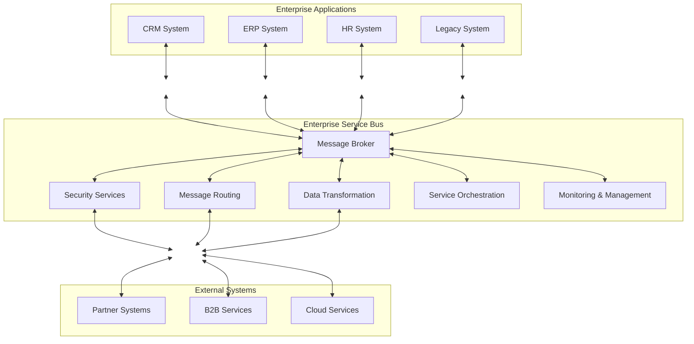
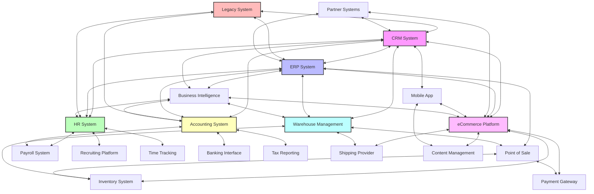
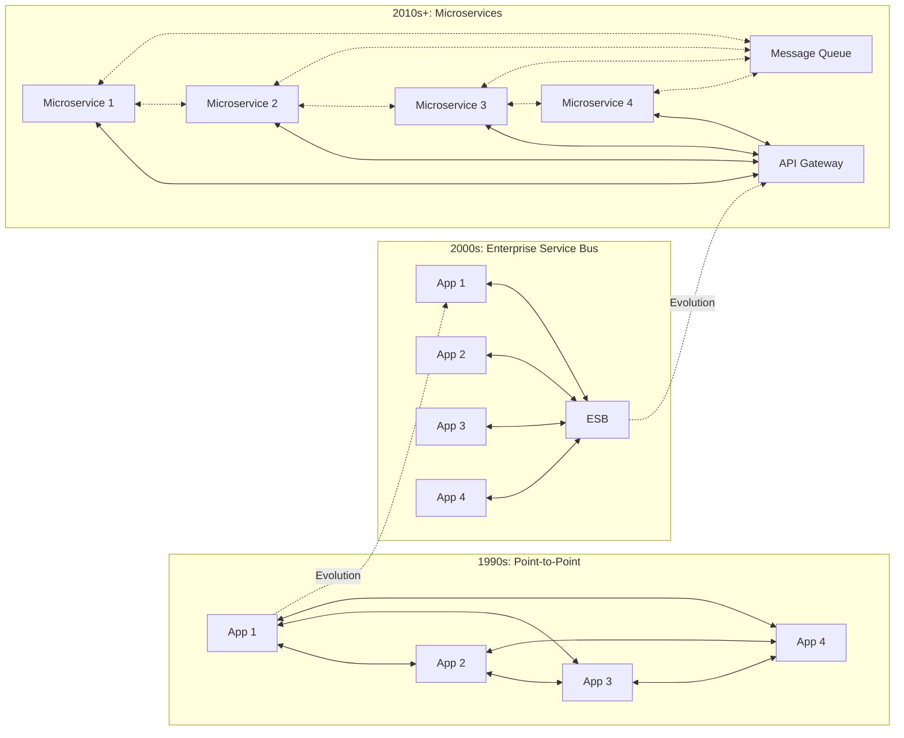

Enterprise Service Bus (ESB) nổi lên như một mẫu kiến trúc quan trọng vào đầu những năm 2000 để giải quyết các thách thức tích hợp mà các tổ chức phải đối mặt khi hệ thống CNTT của họ ngày càng trở nên phức tạp. Hãy cùng khám phá lý do ESB được tạo ra, cách chúng phát triển và vị trí của chúng trong kiến trúc hiện đại.

## Vấn Đề Tích Hợp

Vào cuối những năm 1990 và đầu những năm 2000, các doanh nghiệp phải đối mặt với một thách thức ngày càng lớn: làm thế nào để kết nối ngày càng nhiều hệ thống khác nhau cần giao tiếp với nhau. Các tổ chức thường có:

- Nhiều hệ thống kế thừa được xây dựng trên các nền tảng khác nhau
- Nhiều ứng dụng thương mại có sẵn
- Các giải pháp phần mềm tự xây dựng
- Yêu cầu ngày càng tăng về kết nối với các hệ thống và đối tác bên ngoài

Cách tiếp cận ban đầu là tích hợp điểm-điểm, nơi mỗi hệ thống cần giao tiếp với một hệ thống khác sẽ có một kết nối trực tiếp. Cách tiếp cận này nhanh chóng trở nên không thể quản lý được khi số lượng kết nối tăng theo cấp số nhân với mỗi hệ thống mới (n*(n-1)/2 kết nối cho n hệ thống).

## Sự Xuất Hiện của Enterprise Service Bus

ESB xuất hiện như một giải pháp cho vấn đề "tích hợp mì ống". Thuật ngữ này lần đầu tiên được phổ biến vào khoảng năm 2002 bởi các nhà phân tích và nhà cung cấp giải pháp tích hợp. Khái niệm này vay mượn ý tưởng từ các hệ thống nhắn tin trước đó và các nền tảng EAI (Enterprise Application Integration) nhưng giới thiệu một kiến trúc dạng bus tiêu chuẩn hóa hơn.

ESB hoạt động như một xương sống trung tâm mà qua đó tất cả các dịch vụ và ứng dụng giao tiếp, thay thế nhiều kết nối điểm-điểm bằng một điểm kết nối logic duy nhất.

## Khả Năng Cốt Lõi của ESB

1. **Phần mềm trung gian hướng thông điệp**: Nền tảng của hầu hết các ESB, cung cấp nhắn tin bất đồng bộ đáng tin cậy
2. **Chuyển đổi giao thức**: Dịch giữa các giao thức truyền thông khác nhau (HTTP, JMS, SOAP, v.v.)
3. **Chuyển đổi dữ liệu**: Chuyển đổi định dạng dữ liệu giữa các hệ thống (XML, JSON, CSV, định dạng độc quyền)
4. **Định tuyến thông minh**: Điều hướng thông điệp dựa trên nội dung hoặc quy tắc
5. **Điều phối dịch vụ**: Phối hợp trình tự tương tác dịch vụ
6. **Bảo mật**: Xác thực, phân quyền và mã hóa
7. **Giám sát và quản lý**: Theo dõi luồng thông điệp và tình trạng hệ thống

## Sự Phát Triển Kỹ Thuật

ESB đã phát triển qua nhiều giai đoạn:

### Giai đoạn 1: ESB Độc Quyền (2002-2008)

Các nhà cung cấp như IBM, TIBCO và BEA (sau này được Oracle mua lại) đã phát triển các nền tảng ESB độc quyền toàn diện. Đây thường là các giải pháp nặng nề đòi hỏi đầu tư đáng kể.

### Giai đoạn 2: Mã Nguồn Mở và Tiêu Chuẩn (2008-2014)

Sự trỗi dậy của các ESB mã nguồn mở như Mule, ServiceMix và WSO2 đã dân chủ hóa quyền truy cập vào công nghệ ESB. Các tiêu chuẩn như JBI (Java Business Integration) và sau đó là OSGi (Open Service Gateway initiative) đã cố gắng tiêu chuẩn hóa các thành phần ESB.

### Giai đoạn 3: ESB trong Kỷ Nguyên Đám Mây và API (2014-Nay)

Khi điện toán đám mây và microservices trở nên phổ biến, ESB đã thích nghi để trở nên nhẹ nhàng hơn và tập trung vào API. Nhiều nhà cung cấp ESB truyền thống đã đổi tên sản phẩm của họ thành "Nền tảng Quản lý API" hoặc "Nền tảng Tích hợp dưới dạng Dịch vụ" (iPaaS).

## Tại Sao ESB Đôi Khi Thất Bại

Mặc dù đầy hứa hẹn, ESB không phải lúc nào cũng thành công:

1. **Độ phức tạp**: Nhiều triển khai ESB trở nên quá phức tạp và khó bảo trì
2. **Nút thắt tập trung**: ESB có thể trở thành một điểm lỗi duy nhất
3. **Thách thức quản trị**: Nếu không có quản trị phù hợp, ESB vẫn có thể dẫn đến hỗn loạn tích hợp
4. **Chi phí hiệu suất**: Các lớp xử lý bổ sung làm tăng độ trễ
5. **Chi phí cao**: Các giải pháp ESB doanh nghiệp thường đi kèm với chi phí cấp phép đáng kể

## ESBs so với Các Phương Pháp Tích Hợp Hiện Đại

Sự trỗi dậy của microservices, container hóa và kiến trúc cloud-native đã thay đổi bối cảnh tích hợp:

| Phương pháp ESB | Phương pháp Hiện đại |
|-----------------|----------------------|
| Broker tập trung | Giao tiếp phân tán |
| Chuyển đổi nặng nề | API tiêu chuẩn hóa (REST, GraphQL) |
| Điều phối phức tạp | Biên đạo giữa các dịch vụ |
| Triển khai nặng nề | Dịch vụ nhẹ, container hóa |
| Nền tảng tích hợp nguyên khối | Công cụ chuyên biệt, được xây dựng có mục đích

## ESB Đã Chết Chưa?

Chưa hẳn. Mặc dù các mẫu ESB thuần túy không còn được ưa chuộng trong nhiều dự án mới, các vấn đề cốt lõi mà ESB giải quyết vẫn tồn tại. Nhiều tổ chức đã tìm ra điểm trung gian:

- Sử dụng các công cụ tích hợp nhẹ, mô-đun
- Kết hợp API gateway với hàng đợi thông điệp
- Áp dụng service mesh cho giao tiếp microservice
- Sử dụng kiến trúc hướng sự kiện

Các doanh nghiệp lớn với đầu tư đáng kể vào hệ thống kế thừa thường duy trì ESB cho các hệ thống hiện có trong khi áp dụng các mẫu mới hơn cho phát triển mới.

## Bài Học Kinh Nghiệm

Sự trỗi dậy và phát triển của ESB dạy chúng ta những bài học quý giá cho kiến trúc CNTT:

1. **Tích hợp là tất yếu** - Các hệ thống sẽ luôn cần giao tiếp với nhau
2. **Cân bằng tập trung và phân tán** - Quá nhiều một trong hai sẽ tạo ra vấn đề
3. **Tiêu chuẩn hóa rất quan trọng** - Giao diện chung giảm độ phức tạp tích hợp
4. **Thích ứng với công nghệ thay đổi** - Các phương pháp tích hợp phải phát triển cùng với bối cảnh công nghệ

Dù bạn đang sử dụng ESB truyền thống, API gateway hiện đại hay kết hợp các mẫu tích hợp, thách thức cơ bản vẫn giống nhau: cho phép các hệ thống đa dạng hoạt động cùng nhau hiệu quả trong khi duy trì tính linh hoạt, hiệu suất và độ tin cậy.
