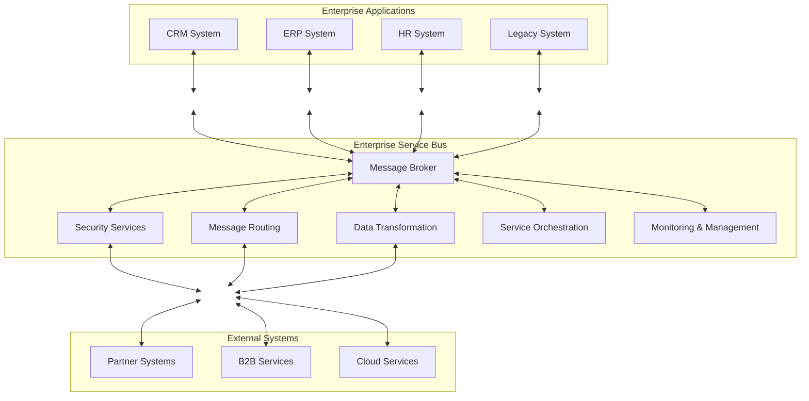
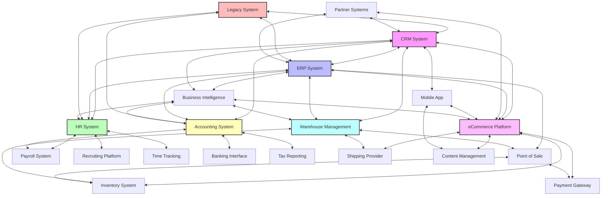
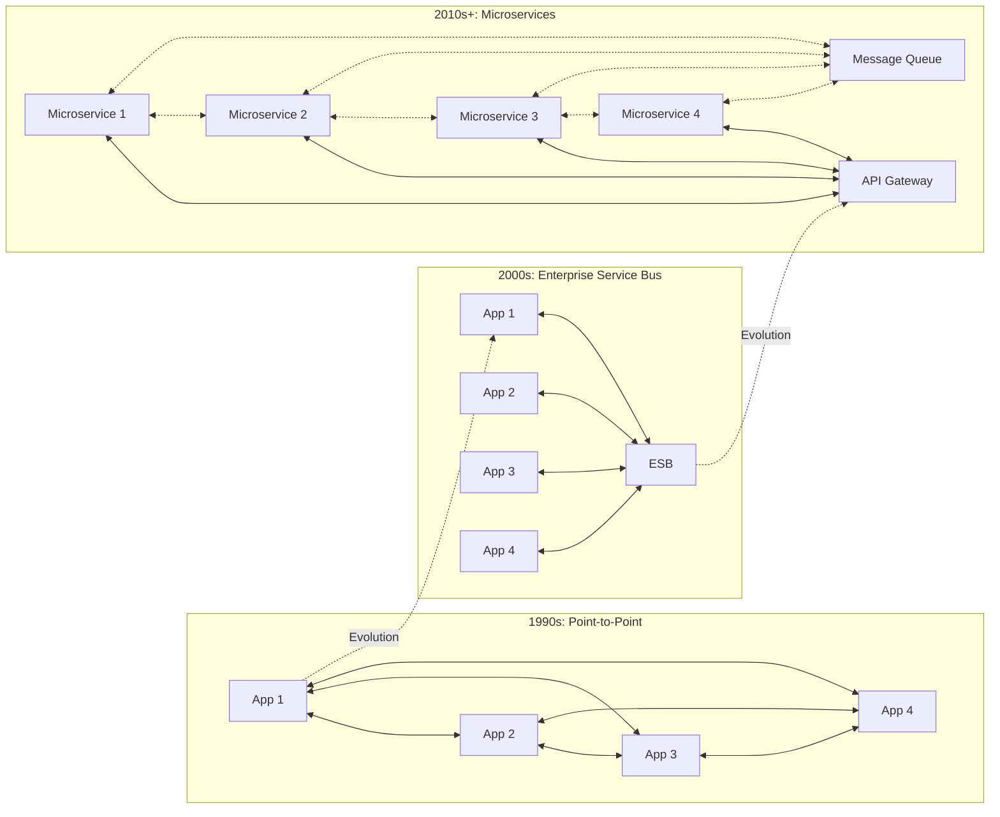

Enterprise Service Bus (ESB) emerged as a critical architectural pattern in the early 2000s to solve integration challenges that organizations faced as their IT landscapes grew increasingly complex. Let's explore why ESBs were created, how they evolved, and their place in modern architecture.

## The Integration Problem

In the late 1990s and early 2000s, enterprises faced a growing challenge: how to connect an increasing number of disparate systems that needed to communicate with each other. Organizations typically had:

- Multiple legacy systems built on different platforms
- Various commercial off-the-shelf applications
- Custom-built software solutions
- Growing requirements to connect with external systems and partners

The initial approach was point-to-point integration, where each system that needed to communicate with another would have a direct connection. This approach quickly became unmanageable as the number of connections grew exponentially with each new system (n*(n-1)/2 connections for n systems).

## Enter the Enterprise Service Bus

The ESB emerged as a solution to this "integration spaghetti" problem. The term was first popularized around 2002 by analysts and integration vendors. The concept borrowed ideas from earlier messaging systems and Enterprise Application Integration (EAI) platforms but introduced a more standardized, bus-like architecture.

An ESB acts as a central backbone through which all services and applications communicate, replacing the many point-to-point connections with a single logical connection point.

## Core Capabilities of an ESB

1. **Message-oriented middleware**: The foundation of most ESBs, providing reliable asynchronous messaging
2. **Protocol conversion**: Translating between different communication protocols (HTTP, JMS, SOAP, etc.)
3. **Data transformation**: Converting data formats between systems (XML, JSON, CSV, proprietary formats)
4. **Intelligent routing**: Directing messages based on content or rules
5. **Service orchestration**: Coordinating the sequence of service interactions
6. **Security**: Authentication, authorization, and encryption
7. **Monitoring and management**: Tracking message flows and system health

## The Technical Evolution

The ESB evolved through several phases:

### Phase 1: Proprietary ESBs (2002-2008)

Vendors like IBM, TIBCO, and BEA (later acquired by Oracle) developed comprehensive proprietary ESB platforms. These were often heavyweight solutions requiring significant investment.

### Phase 2: Open Source and Standards (2008-2014)

The rise of open source ESBs like Mule, ServiceMix, and WSO2 democratized access to ESB technology. Standards like JBI (Java Business Integration) and later OSGi (Open Service Gateway initiative) attempted to standardize ESB components.

### Phase 3: ESB in the Cloud and API Era (2014-Present)

As cloud computing and microservices gained popularity, ESBs adapted to become more lightweight and API-centric. Many traditional ESB vendors rebranded their products as "API Management Platforms" or "Integration Platforms as a Service" (iPaaS).

## Why ESBs Sometimes Failed

Despite their promise, ESBs weren't always successful:

1. **Complexity**: Many ESB implementations became overly complex and difficult to maintain
2. **Centralized bottleneck**: The ESB could become a single point of failure
3. **Governance challenges**: Without proper governance, ESBs could still lead to integration chaos
4. **Performance overhead**: Additional processing layers added latency
5. **High cost**: Enterprise ESB solutions often came with substantial licensing costs

## ESBs vs. Modern Integration Approaches

The rise of microservices, containerization, and cloud-native architectures has changed the integration landscape:

| ESB Approach | Modern Approach |
|--------------|----------------|
| Centralized broker | Distributed communication |
| Heavy transformation | Standardized APIs (REST, GraphQL) |
| Complex orchestration | Choreography between services |
| Heavyweight deployment | Lightweight, containerized services |
| Monolithic integration platform | Specialized, purpose-built tools |

## Is the ESB Dead?

Not quite. While pure ESB patterns have fallen out of favor in many new projects, the core problems that ESBs solved still exist. Many organizations have found a middle ground:

- Using lightweight, modular integration tools
- Combining API gateways with message queues
- Adopting service meshes for microservice communication
- Employing event-driven architectures

Large enterprises with significant legacy investments often maintain ESBs for existing systems while adopting newer patterns for new development.

## Lessons Learned

The rise and evolution of the ESB teaches valuable lessons for IT architecture:

1. **Integration is inevitable** - Systems will always need to communicate
2. **Balance centralization and distribution** - Too much of either creates problems
3. **Standardization matters** - Common interfaces reduce integration complexity
4. **Adapt to changing technologies** - Integration approaches must evolve with the technology landscape

Whether you're using a traditional ESB, a modern API gateway, or a combination of integration patterns, the fundamental challenge remains the same: enabling diverse systems to work together effectively while maintaining agility, performance, and reliability.
