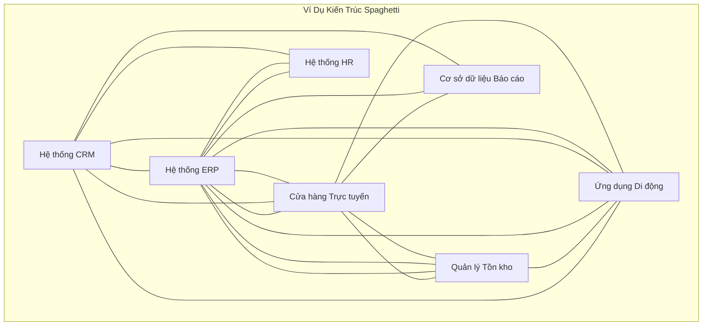
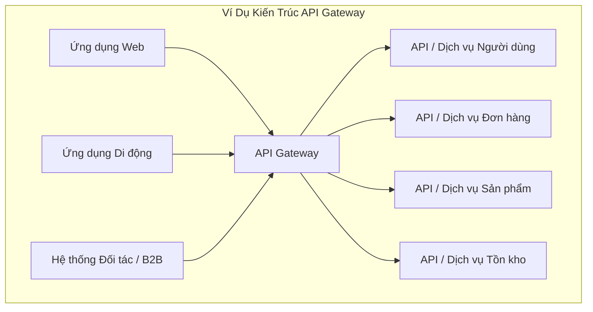

Xin chào mọi người, và chào mừng đến với bài đăng đầu tiên trong loạt hướng dẫn MuleSoft của chúng tôi! Là một nhà phát triển MuleSoft cấp cao, tôi thường thấy các công ty gặp khó khăn với việc kết nối số lượng ứng dụng ngày càng tăng của họ. Nếu bạn mới làm quen với tích hợp hoặc tò mò về MuleSoft, bạn đã đến đúng nơi. Hãy bắt đầu với một câu chuyện quen thuộc.

## Nỗi Đau Lớn Lên: Cơn Đau Đầu Tích Hợp của Acme Corp

Hãy tưởng tượng một công ty, chúng ta hãy gọi nó là "Acme Corp". Họ bắt đầu nhỏ, có thể chỉ với một hệ thống tồn kho và một cửa hàng trực tuyến đơn giản. Cuộc sống thật tốt đẹp. Nhưng khi Acme lớn lên, họ thêm nhiều phần mềm hơn: CRM cho bán hàng, ERP cho tài chính, hệ thống HR riêng, có thể là ứng dụng di động... nghe quen không?

Mỗi lần có hệ thống mới, họ cần nó giao tiếp với các hệ thống khác. "Chúng tôi cần dữ liệu khách hàng từ CRM trong ERP!" hoặc "Đồng bộ tồn kho từ ERP đến cửa hàng trực tuyến!" Vì vậy, các nhà phát triển đã làm điều có vẻ hợp lý: họ xây dựng các kết nối trực tiếp. CRM nói chuyện với ERP. ERP nói chuyện với cửa hàng. Cửa hàng nói chuyện với hệ thống tồn kho. Ứng dụng di động nói chuyện với *mọi thứ*.

Ban đầu, **tích hợp điểm-điểm** này hoạt động. Nhưng chẳng bao lâu, bức tranh CNTT của Acme trông như thế này:

Đây, các bạn của tôi, được gọi một cách trìu mến (hoặc bực bội) là **Kiến trúc Spaghetti**.

### Tại Sao Kiến Trúc Spaghetti Gây Khó Tiêu

Mặc dù các kết nối trực tiếp có vẻ đơn giản lúc đầu, cách tiếp cận này nhanh chóng trở thành cơn ác mộng:

* **Độ phức tạp:** Mỗi hệ thống mới có khả năng yêu cầu kết nối đến nhiều hệ thống hiện có. Số lượng kết nối bùng nổ! Việc quản lý và hiểu mạng lưới này trở nên cực kỳ khó khăn.
* **Dễ vỡ:** Nếu một hệ thống thay đổi định dạng dữ liệu hoặc API, *tất cả các hệ thống* kết nối trực tiếp với nó đều cần sửa đổi. Một thay đổi nhỏ có thể gây ra một loạt lỗi. Bảo trì rất tốn kém và chậm chạp.
* **Khả năng tái sử dụng kém:** Logic để kết nối với một hệ thống cụ thể (ví dụ: lấy dữ liệu khách hàng) có thể bị trùng lặp ở nhiều nơi.
* **Khó mở rộng:** Thêm hệ thống mới hoặc mở rộng hệ thống hiện có trở thành một dự án lớn liên quan đến việc gỡ rối và kết nối lại.
* **Thiếu khả năng quan sát:** Hiểu luồng dữ liệu trên toàn tổ chức gần như không thể. Gỡ lỗi giống như tìm một sợi mì cụ thể trong tô spaghetti.

Acme Corp nhận ra họ cần một cách tốt hơn. Họ cần **phần mềm trung gian**.

## Sự Xuất Hiện của Người Điều Khiển Giao Thông: Enterprise Service Bus (ESB)

Để giải quyết mớ hỗn độn spaghetti, khái niệm **Enterprise Service Bus (ESB)** đã xuất hiện. Hãy nghĩ về ESB như một xương sống giao tiếp trung tâm hoặc một "bus" phần mềm trung gian mà các ứng dụng cắm vào, thay vì nói chuyện trực tiếp với nhau.

### Khái Niệm ESB

* **Trung gian:** ESB có thể chuyển đổi định dạng dữ liệu giữa các hệ thống khác nhau (ví dụ: XML sang JSON).
* **Định tuyến:** Nó hướng thông điệp từ hệ thống nguồn đến đúng hệ thống đích.
* **Chuyển đổi Giao thức:** Nó có thể xử lý giao tiếp giữa các hệ thống sử dụng các giao thức khác nhau (ví dụ: HTTP sang JMS).
* **Tập trung hóa:** Cung cấp một điểm duy nhất để quản lý và giám sát tích hợp.

### Điểm Mạnh của ESB

* **Tách rời:** Các hệ thống không cần biết chi tiết cụ thể (vị trí, giao thức, định dạng dữ liệu) của các hệ thống khác. Chúng chỉ nói chuyện với ESB.
* **Khả năng tái sử dụng:** Logic tích hợp chung (như chuyển đổi dữ liệu hoặc xác thực) thường có thể được xây dựng trong ESB và tái sử dụng.
* **Cải thiện khả năng bảo trì:** Các thay đổi trong một hệ thống ít khả năng ảnh hưởng đến các hệ thống khác, vì ESB xử lý việc trung gian.

### Điểm Yếu của ESB

* **Nút thắt tiềm ẩn:** Nếu không được thiết kế đúng, ESB trung tâm có thể trở thành nút thắt hiệu suất.
* **Độ phức tạp:** Việc triển khai và quản lý một ESB giàu tính năng có thể phức tạp.
* **Khóa nhà cung cấp:** ESB truyền thống đôi khi có thể dẫn đến phụ thuộc vào công nghệ của một nhà cung cấp cụ thể.
* **Không phải lúc nào cũng tập trung vào API:** Mặc dù ESB có thể expose các dịch vụ, trọng tâm chính của chúng thường là tích hợp hệ thống nội bộ, không nhất thiết là quản lý các API hiện đại hướng ra bên ngoài.

## Người Gác Cổng: API Gateway

Khi API (Giao diện Lập trình Ứng dụng) trở thành tiêu chuẩn cho các ứng dụng giao tiếp, đặc biệt qua web và di động, một phần mềm trung gian khác đã nổi lên: **API Gateway**.

Hãy nghĩ về API Gateway như một điểm vào chuyên biệt *dành riêng cho việc quản lý API*. Nó nằm phía trước các dịch vụ backend hoặc API của bạn và hoạt động như người gác cổng và quản lý lưu lượng cho khách hàng bên ngoài (và đôi khi nội bộ).

### Khái Niệm API Gateway

* **Expose API:** Trình bày các dịch vụ backend dưới dạng API được quản lý.
* **Thực thi Bảo mật:** Xử lý xác thực, phân quyền, giới hạn tốc độ và các chính sách bảo mật khác.
* **Quản lý Lưu lượng:** Cân bằng tải, chuyển đổi yêu cầu/phản hồi, lưu cache.
* **Giám sát & Phân tích:** Thu thập nhật ký và số liệu về việc sử dụng API.

### ESB so với API Gateway: Sự Khác Biệt Là Gì?

Mặc dù có sự chồng chéo, trọng tâm của chúng khác nhau:

* **ESB:** Chủ yếu tập trung vào **tích hợp các hệ thống nội bộ đa dạng** sử dụng nhiều giao thức và định dạng dữ liệu. Thường liên quan đến điều phối phức tạp và logic trung gian *bên trong* bus. Hãy nghĩ: Xương sống tích hợp Hệ thống-đến-Hệ thống.
* **API Gateway:** Chủ yếu tập trung vào **quản lý, bảo mật và expose API** (thường là REST hoặc SOAP) cho người tiêu dùng bên ngoài hoặc nội bộ. Hoạt động như một mặt tiền hoặc proxy ngược cho các dịch vụ backend. Hãy nghĩ: Bộ điều khiển lưu lượng API và nhân viên bảo vệ.

Một công cụ có thể làm cả hai không? Có, các nền tảng tích hợp hiện đại thường làm mờ ranh giới.

## Chọn Công Cụ Của Bạn: Bối Cảnh ESB so với API Gateway

Khi nào bạn sử dụng cái nào?

* **Cân nhắc cách tiếp cận ESB khi:** Thách thức chính của bạn là tích hợp nhiều hệ thống nội bộ kế thừa hoặc đa dạng với các giao thức khác nhau và nhu cầu định tuyến/chuyển đổi phức tạp.
* **Cân nhắc API Gateway khi:** Mục tiêu chính của bạn là expose các dịch vụ backend dưới dạng API được quản lý, bảo mật chúng, xử lý lưu lượng từ khách hàng web/di động và có được thông tin chi tiết về việc sử dụng API.

**Lưu ý Quan trọng:** Nhiều nền tảng hiện đại cung cấp khả năng bao trùm cả hai lĩnh vực.

## Giới Thiệu MuleSoft: Nền Tảng Tích Hợp Thống Nhất

Vậy, **MuleSoft** phù hợp ở đâu?

**MuleSoft là gì?**

MuleSoft, hiện là một phần của Salesforce, cung cấp **Anypoint Platform**, một **nền tảng tích hợp thống nhất** hàng đầu. Nó được thiết kế để kết nối *bất kỳ* ứng dụng, nguồn dữ liệu hoặc thiết bị nào, dù trên đám mây hay tại chỗ.

**MuleSoft hoạt động như thế nào?**

MuleSoft kết hợp khả năng của cả ESB truyền thống và API Gateway hiện đại, được xây dựng trên khái niệm **kết nối dẫn đầu bằng API**. Thay vì chỉ điểm-điểm hoặc một ESB nguyên khối, MuleSoft khuyến khích xây dựng các API có thể tái sử dụng để mở khóa dữ liệu và khả năng trên toàn tổ chức.

Nó hoạt động như:

* **ESB:** Để tích hợp hệ thống nội bộ phức tạp, chuyển đổi dữ liệu (sử dụng ngôn ngữ DataWeave mạnh mẽ của nó) và kết nối hệ thống kế thừa.
* **API Gateway:** Để thiết kế, xây dựng, bảo mật, quản lý và phân tích API.

**Các Thành phần Chính (Nhìn Nhanh):**

* **Anypoint Platform:** Giao diện web thống nhất để quản lý mọi thứ.
* **Anypoint Studio:** IDE trên máy tính để bàn để thiết kế và xây dựng tích hợp (ứng dụng Mule).
* **Mule Runtime Engine:** Engine nhẹ chạy các ứng dụng Mule của bạn.
* **Connectors:** Connector dựng sẵn cho hàng trăm hệ thống và giao thức (cơ sở dữ liệu, ứng dụng SaaS, hàng đợi thông điệp, v.v.).
* **API Manager:** Quản trị và bảo mật API của bạn.
* **Anypoint Exchange:** Một thị trường để khám phá và chia sẻ các tài sản có thể tái sử dụng như API và connector.

Mục tiêu của MuleSoft là làm cho tích hợp dễ dàng hơn và nhanh hơn, chuyển từ các kết nối dễ vỡ sang một mạng lưới linh hoạt các API có thể tái sử dụng.

## Tổng Kết Phần 1

Chúng ta đã đi từ sự hỗn loạn của kiến trúc spaghetti, qua các cách tiếp cận có cấu trúc của ESB và API Gateway, và đến tầm nhìn thống nhất của MuleSoft về tích hợp. Hiểu được sự phát triển này là chìa khóa để đánh giá cao *lý do* tại sao MuleSoft lại là một công cụ mạnh mẽ trong thế giới kết nối ngày nay.

Trong bài đăng tiếp theo, chúng ta sẽ thực hành! Chúng tôi sẽ đề cập đến **Thiết lập Môi Trường Phát Triển MuleSoft của Bạn**, bao gồm cài đặt Anypoint Studio.

**Có câu hỏi? Suy nghĩ? Hãy chia sẻ trong phần bình luận bên dưới!** Những thách thức tích hợp lớn nhất bạn đã gặp phải là gì?

---