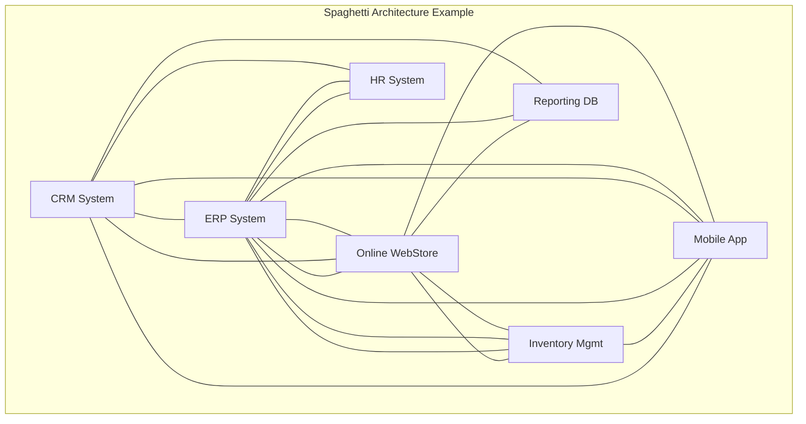
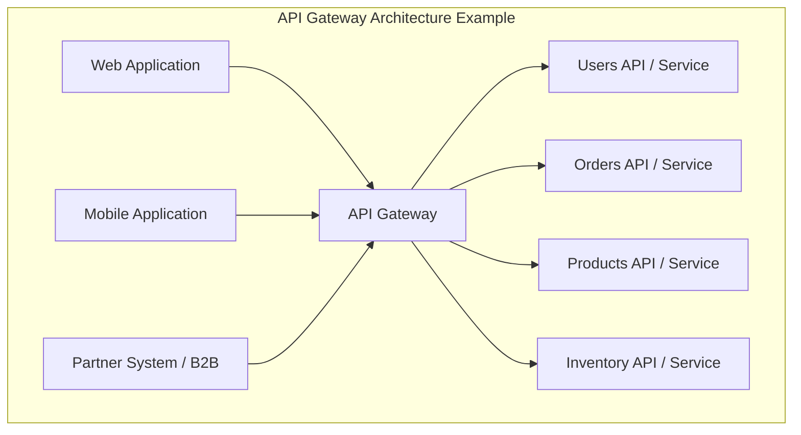

Hey everyone, and welcome to the first post in our MuleSoft Tutorial series! As a senior MuleSoft developer, I often see companies struggling with connecting their ever-growing number of applications. If you're new to integration or curious about MuleSoft, you're in the right place. Let's start with a familiar story.

## The Growing Pains: Acme Corp's Integration Headache

Imagine a company, let's call it "Acme Corp". They started small, maybe with just an inventory system and a simple online store. Life was good. But as Acme grew, they added more software: a CRM for sales, an ERP for finance, a dedicated HR system, maybe a mobile app... sound familiar?

Each time a new system arrived, they needed it to talk to the others. "We need customer data from the CRM in our ERP!" or "Sync inventory from the ERP to the online store!" So, the developers did what seemed logical: they built direct connections. CRM talks to ERP. ERP talks to the store. The store talks to the inventory system. The mobile app talks to *everything*.

Initially, this **point-to-point integration** worked. But soon, Acme's IT landscape looked like this:

This, my friends, is affectionately (or frustratingly) known as **Spaghetti Architecture**.

### Why Spaghetti Architecture Gives You Indigestion

While direct connections seem simple at first, this approach quickly becomes a nightmare:

* **Complexity:** Every new system potentially requires connections to many existing systems. The number of connections explodes! Managing and understanding this web becomes incredibly difficult.
* **Brittleness:** If one system changes its data format or API, *every single system* directly connected to it needs modification. A small change can cause a cascade of failures. Maintenance is costly and slow.
* **Poor Reusability:** Logic for connecting to a specific system (e.g., fetching customer data) might be duplicated in multiple places.
* **Difficult to Scale:** Adding new systems or scaling existing ones becomes a major project involving untangling and re-wiring connections.
* **Lack of Visibility:** Understanding data flow across the entire organization is nearly impossible. Troubleshooting feels like finding a specific noodle in the spaghetti bowl.

Acme Corp realized they needed a better way. They needed **middleware**.

## Enter the Traffic Cop: The Enterprise Service Bus (ESB)

To solve the spaghetti mess, the concept of an **Enterprise Service Bus (ESB)** emerged. Think of an ESB as a central communication backbone or a middleware "bus" that applications plug into, instead of talking directly to each other.

### ESB Concepts

* **Mediation:** The ESB can translate data formats between different systems (e.g., XML to JSON).
* **Routing:** It directs messages from a source system to the correct destination system(s).
* **Protocol Transformation:** It can handle communication between systems using different protocols (e.g., HTTP to JMS).
* **Centralization:** Provides a single point for managing and monitoring integrations.

### Strengths of ESB

* **Decoupling:** Systems don't need to know the specific details (location, protocol, data format) of other systems. They just talk to the ESB.
* **Reusability:** Common integration logic (like data transformation or authentication) can often be built into the ESB and reused.
* **Improved Maintainability:** Changes in one system are less likely to impact others, as the ESB handles the mediation.

### Weaknesses of ESB

* **Potential Bottleneck:** If not designed correctly, the central ESB itself can become a performance bottleneck.
* **Complexity:** Implementing and managing a feature-rich ESB can be complex.
* **Vendor Lock-in:** Traditional ESBs could sometimes lead to dependency on a specific vendor's technology.
* **Not Always API-Focused:** While ESBs can expose services, their primary focus was often internal system-to-system integration, not necessarily managing modern, external-facing APIs.

## The Gatekeeper: The API Gateway

As APIs (Application Programming Interfaces) became the standard way for applications to communicate, especially over the web and mobile, another piece of middleware gained prominence: the **API Gateway**.

Think of an API Gateway as a specialized entry point *specifically for managing APIs*. It sits in front of your backend services or APIs and acts as a gatekeeper and traffic manager for external (and sometimes internal) clients.

### API Gateway Concepts

* **API Exposure:** Presents backend services as managed APIs.
* **Security Enforcement:** Handles authentication, authorization, rate limiting, and other security policies.
* **Traffic Management:** Load balancing, request/response transformation, caching.
* **Monitoring & Analytics:** Collects logs and metrics about API usage.

### ESB vs. API Gateway: What's the Difference?

While there's overlap, their focus differs:

* **ESB:** Primarily focused on **integrating diverse internal systems** using various protocols and data formats. Often involves complex orchestration and mediation logic *within* the bus. Think: System-to-System integration backbone.
* **API Gateway:** Primarily focused on **managing, securing, and exposing APIs** (often REST or SOAP) to external or internal *consumers*. Acts as a facade or reverse proxy for backend services. Think: API traffic controller and security guard.

Can one tool do both? Yes, modern integration platforms often blur the lines.

## Choosing Your Tool: ESB vs. API Gateway Landscape

When do you use which?

* **Consider an ESB approach when:** Your main challenge is integrating many legacy or diverse internal systems with different protocols and complex routing/transformation needs. (Examples: IBM Integration Bus, Oracle Service Bus, older versions of Mule ESB were often used here).
* **Consider an API Gateway when:** Your main goal is to expose backend services as managed APIs, secure them, handle traffic from web/mobile clients, and gain insights into API usage. (Examples: Kong, Apigee (Google), AWS API Gateway, Azure API Management).

**Important Note:** Many modern platforms offer capabilities spanning both areas.

## Introducing MuleSoft: The Unified Integration Platform

So, where does **MuleSoft** fit into all this?

**What is MuleSoft?**

MuleSoft, now part of Salesforce, provides the **Anypoint Platform**, a leading **unified integration platform**. It's designed to connect *any* application, data source, or device, whether in the cloud or on-premises.

**How does MuleSoft Work?**

MuleSoft combines the capabilities of both traditional ESBs and modern API Gateways, built on the concept of **API-led connectivity**. Instead of just point-to-point or a monolithic ESB, MuleSoft encourages building reusable APIs to unlock data and capabilities across the organization.

It acts as:

* An **ESB:** For complex internal system integration, data transformation (using its powerful DataWeave language), and connecting legacy systems.
* An **API Gateway:** For designing, building, securing, managing, and analyzing APIs.

**Key Components (A Quick Peek):**

* **Anypoint Platform:** The unified web interface for managing everything.
* **Anypoint Studio:** The desktop IDE for designing and building integrations (Mule applications).
* **Mule Runtime Engine:** The lightweight engine that runs your Mule applications.
* **Connectors:** Pre-built connectors for hundreds of systems and protocols (databases, SaaS apps, message queues, etc.).
* **API Manager:** Governs and secures your APIs.
* **Anypoint Exchange:** A marketplace for discovering and sharing reusable assets like APIs and connectors.

MuleSoft's goal is to make integration easier and faster, moving away from brittle connections towards a flexible network of reusable APIs.

## Wrapping Up Part 1

We've journeyed from the chaos of spaghetti architecture, through the structured approaches of ESB and API Gateway, and arrived at MuleSoft's unified vision for integration. Understanding this evolution is key to appreciating *why* MuleSoft is such a powerful tool in today's connected world.

In the next post, we'll get hands-on! We'll cover **Setting Up Your MuleSoft Development Environment**, including installing Anypoint Studio.

**Questions? Thoughts? Share them in the comments below!** What are the biggest integration challenges you've faced?

---
