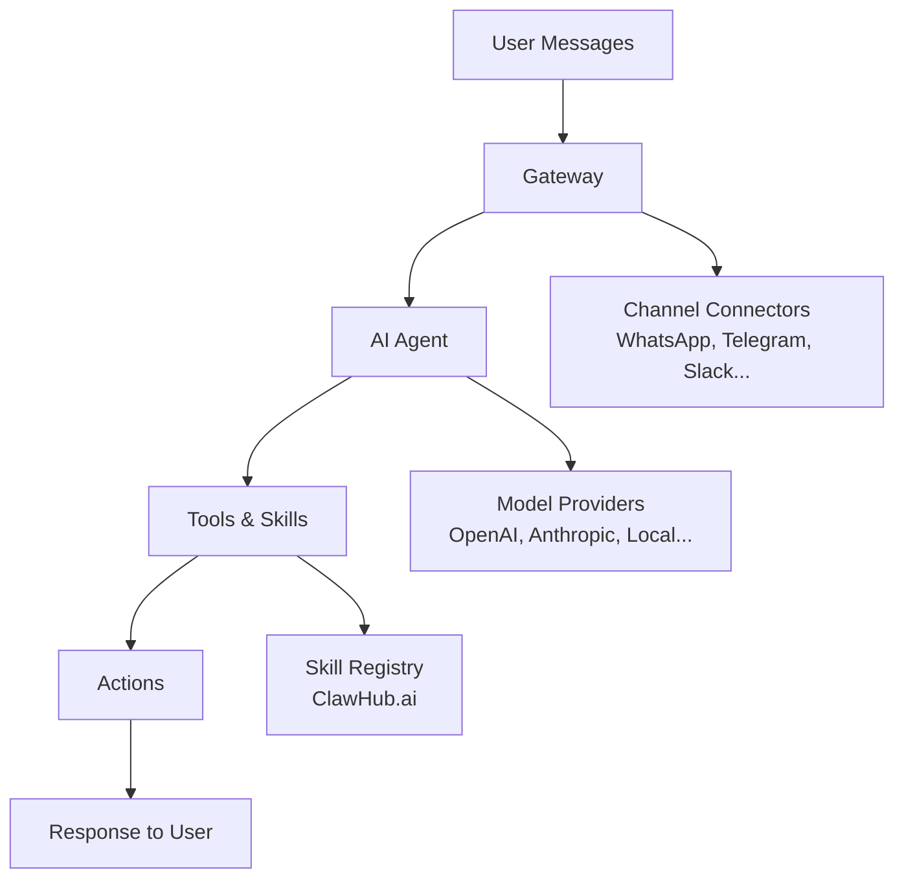

*As a fullstack developer with 8 years of experience across banking systems, cloud platforms, and now indie mobile development, I've seen my share of tech trends. But few have captured my attention like OpenClaw - a personal AI assistant that's currently the fastest-growing project on GitHub. In this deep dive, I'll share my hands-on experience and technical analysis of why this project is resonating with developers worldwide.*

## What is OpenClaw?

OpenClaw is a **personal AI assistant you run on your own devices**. Unlike cloud-based chatbots, OpenClaw operates locally (or on your own infrastructure) and connects to the messaging channels you already use: WhatsApp, Telegram, Slack, Discord, Signal, and many more. The core philosophy is "local-first" - your data stays with you, and the assistant feels responsive because it's running close to you.

### Key Features That Stand Out:

1. **Multi-channel inbox** - Single assistant across all your messaging platforms
2. **Voice capabilities** - Wake words on macOS/iOS, continuous voice on Android
3. **Live Canvas** - Agent-driven visual workspace for interactive tasks
4. **First-class tools** - Browser, canvas, nodes, cron jobs, and session management
5. **Companion apps** - macOS menu bar, iOS, and Android applications

## Technical Architecture: A Developer's Perspective

Having worked with enterprise integration platforms like MuleSoft and message brokers like AWS MSK, I appreciate OpenClaw's clean architecture:

### The Gateway Pattern
At its core, OpenClaw uses a **Gateway** as the control plane. This is reminiscent of API gateway patterns in microservices, but applied to personal AI:



### Security Model: Sandboxing by Default
One of the most impressive aspects is the security-first approach:

- **Default sandboxing** for non-main sessions
- **DM pairing** for unknown senders (requires explicit approval)
- **Tool permission system** with allow/deny lists
- **Local data storage** unless explicitly configured otherwise

As someone who's implemented security controls in banking systems, I appreciate this cautious approach for a tool with such broad access.

## My Hands-On Experience

### Installation & Setup
The installation process is straightforward for developers:

```bash
npm install -g openclaw@latest
# or
pnpm add -g openclaw@latest

openclaw onboard --install-daemon
```

The onboarding wizard guides you through:
1. Gateway setup
2. Workspace configuration  
3. Channel connections
4. Skill installation

### Daily Use Cases
After a week of testing, here's how I've been using OpenClaw:

1. **Code Assistance** - Asking for help with Flutter/Dart issues while developing mobile apps
2. **Content Research** - Gathering information for blog posts (like this one!)
3. **Task Automation** - Setting up cron jobs for regular checks
4. **Multi-platform Messaging** - Single interface for Telegram, WhatsApp, and Discord

### Performance & Responsiveness
Running locally on my development machine, the response time is noticeably faster than cloud-based alternatives. The lack of network latency makes conversations feel more natural.

## Why Developers Are Flocking to OpenClaw

### 1. The "Local-First" Movement
There's growing skepticism about sending all personal data to cloud AI services. OpenClaw taps into this sentiment by offering a self-hosted alternative.

### 2. Extensibility Through Skills
The skill system reminds me of package managers like npm or pub.dev. Developers can:
- Create custom skills for specific tasks
- Share skills via [ClawHub](https://clawhub.ai)
- Modify existing skills for their needs

### 3. Business Model Transparency
Unlike many AI startups with unclear monetization, OpenClaw is open-source with optional paid services. This transparency builds trust in the developer community.

### 4. Cross-Platform Compatibility
With support for macOS, Linux, Windows (via WSL2), iOS, and Android, it covers the full spectrum of developer environments.

## Comparison with Alternatives

| Feature | OpenClaw | ChatGPT | Claude | Local LLMs |
|---------|----------|---------|--------|------------|
| **Self-hosted** | ✅ Yes | ❌ No | ❌ No | ✅ Yes |
| **Multi-channel** | ✅ 20+ platforms | ❌ Web only | ❌ Web/API | ❌ Usually API only |
| **Voice** | ✅ Native | ❌ Third-party | ❌ Third-party | ❌ Requires setup |
| **Extensibility** | ✅ Skills system | ❌ Limited | ❌ Limited | ⚠️ Varies |
| **Cost** | Free + optional services | Subscription | Subscription | Hardware + electricity |
| **Data Privacy** | Your infrastructure | Their servers | Their servers | Your infrastructure |

## For Mobile Developers: Flutter Integration Potential

As an indie Flutter developer with apps on both Play Store and App Store, I see exciting integration possibilities:

### Potential Flutter Plugin Features:
1. **Voice interface** for hands-free operation
2. **Notification integration** for AI responses
3. **Custom skills** specific to mobile development
4. **Canvas rendering** for visual task management

The OpenClaw node system could be extended to mobile devices, creating a truly ubiquitous personal assistant.

## Getting Started: A Practical Guide

### Minimum Requirements:
- **Node.js 24** (recommended) or Node 22.16+
- **npm, pnpm, or bun** package manager
- **5-10GB storage** for models and data
- **Modern CPU** (ARM64 or x86_64)

### Recommended First Steps:
1. **Start with the web interface** before connecting personal messaging accounts
2. **Experiment with built-in skills** before creating custom ones
3. **Set up sandboxing** if planning to use with untrusted inputs
4. **Join the Discord community** for support and ideas

### Common Pitfalls to Avoid:
- **Don't skip the security configuration** - especially for public-facing instances
- **Start with a single channel** before connecting everything
- **Monitor resource usage** - some skills can be resource-intensive
- **Backup your workspace** regularly

## The Future of Personal AI

OpenClaw represents a shift in how we think about AI assistants. Instead of locked-down SaaS products, we're moving toward:

1. **User-controlled infrastructure** - Your data, your rules
2. **Composable intelligence** - Mix and match models and skills
3. **Ubiquitous access** - Same assistant everywhere
4. **Community-driven development** - Open source collaboration

## Conclusion: Should You Try OpenClaw?

**If you're a developer who values:**
- Privacy and data ownership
- Extensible tools
- Local performance
- Open-source transparency

**Then OpenClaw is worth exploring.** It's not just another chatbot - it's a platform for building your personalized AI ecosystem.

The project's explosive growth on GitHub (consistently trending with thousands of new stars weekly) suggests I'm not alone in seeing its potential. As AI becomes more integrated into our daily workflows, tools like OpenClaw that put control back in users' hands will only become more valuable.

### Resources to Continue Your Journey:
- [OpenClaw GitHub Repository](https://github.com/openclaw/openclaw)
- [Official Documentation](https://docs.openclaw.ai)
- [ClawHub Skill Registry](https://clawhub.ai)
- [Community Discord](https://discord.gg/clawd)

*Have you tried OpenClaw or similar self-hosted AI assistants? Share your experiences in the comments below!*

---

*About the author: I'm a fullstack developer with 8 years of experience in banking systems (MuleSoft, AWS MSK, GoAnywhere MFT) turned indie mobile developer using Flutter. I write about technology trends, open-source projects, and developer productivity on [minixium.com](https://minixium.com).*