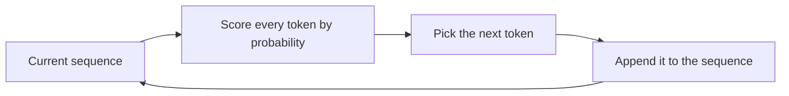

*Part 2 of a 3-part series on Retrieval-Augmented Generation. Part 1 covered what RAG is; here we look inside the LLM to understand why retrieval helps — and why hallucination is baked into the design.*

## An LLM is a very good autocomplete

LLMs are sometimes jokingly called "fancy autocomplete," and that's actually a pretty accurate description. All an LLM does is predict the next word that should appear in a piece of text.

Show a person the unfinished phrase *"what a beautiful day the sun is…"* and they can guess how it ends. The LLM does the same. Given that prompt, "shining" is the most plausible completion — though "rising" or "out" would also work. The starting phrase is called the **prompt**, and each finished phrase is a **completion**.

Some completions are grammatically valid but implausible. *"The sun is exploding"* is perfectly good English, but it isn't realistic — the sun doesn't explode, certainly not on a nice day. You have an intuition about how words are used; in a sense, so does the model.

Technically, an LLM is a huge neural network — a complex mathematical model of language. It stores information about which words tend to be used together, their typical order, and, at a higher level, what those words mean in context. That mathematical representation of language is what the final model uses to generate new text.

## Tokens, not words

When an LLM generates a response, it appends new words to the end of the prompt, one at a time. Technically it doesn't generate *words* but **tokens** — a more general term for pieces of words. Some words ("London", "door") may get their own token; common compounds ("programmatically", "unhappy") are often split into several tokens. Punctuation can have its own tokens too. Most LLMs have a vocabulary of about 10,000 to over 100,000 tokens, and building words from smaller fragments lets the model produce any word without assigning a token to every possible word.

Before adding each new token, the model runs a process:

1. It processes the current state of the completion, building a deep understanding of the relationships between each word and the overall meaning.
2. It looks at every token in its vocabulary — often tens or hundreds of thousands — and computes the probability that it comes next.

In our example, "shining" might have the highest probability and "rising" a lower one — but even unlikely words like "exploding" or "snoring" keep a small chance.

## Autoregression: each choice shapes the next

The tokens the model chose earlier affect the choices it makes later. That's desirable: new tokens make sense in the context of the ones already chosen. But it also means that once the model randomly picks a direction, it follows it to the end.

If it chooses "shining", it may then pick "in", "the", and "sky" — all sensible given what came before. But if the first token were "warming", it might instead choose "our faces", because that fits the direction the model started down. This is called being **autoregressive** — self-influencing. Combined with randomness, it means running the same prompt through the same LLM several times often produces different results.

An LLM can understand the meaning of a question and make reasonable predictions because it was trained on large collections of text. The mathematical model behind it has billions of individual parameters (arithmetic weights). Before training, that model outputs only gibberish.

## How training works

During training, the LLM is shown incomplete text from its training data and tries to predict the next word. Based on how accurate those predictions are, it updates its internal parameters. This is how it learns both factual information and the *style* of the language in the data. Many modern LLMs are trained on trillions of words, mostly from the open internet. The resulting models can generate text in many styles and topics precisely because examples of those styles and facts about those topics are in the training data.

## Why LLMs hallucinate

Understanding how LLMs work and how they're trained also explains a lot of their behavior. Start with hallucination: all an LLM can do is generate **likely** sequences of words based on the patterns it learned.

If you ask an LLM about your company's private internal data, or today's news, the model was almost certainly not trained on that information — so it isn't in a good position to answer. In those cases it will sometimes produce answers that sound right but are actually incorrect. Even though we call this hallucination, remember the model isn't having a psychological episode or truly malfunctioning: it is designed to produce **likely** text, not **truthful** text. To the LLM, truth is simply a sequence of words that is highly probable given its training data. With high-quality training data, our intuitive sense of truth and the model's mathematical sense of probable word sequences can stay aligned. The challenge, then, is making sure the LLM has access to as much relevant information as possible.

## How RAG fixes it (and why you can't just add everything)

RAG solves the problem by leaning on the LLM's ability to understand context. If your RAG system puts relevant information into the prompt, the LLM can understand and weave that information into its response **even if it was never part of the training data**. This is often described as *grounding* the response.

You might think you should just add as much relevant information as possible. In practice there are two reasons you can't:

1. **Longer prompts cost more compute.** Before generating each new token, the model performs a computationally expensive scan over every token already in the completion — including the original prompt.
2. **You hit the context window.** Every model has a maximum amount of text it can process at once. Older models handled only a few thousand tokens; newer ones can handle millions. But as the retriever adds more information, you first make your prompt more expensive and eventually exhaust the model's context window entirely.

So retrieval has to be *selective* — and that's the whole game. How does a system decide which documents are worth putting in the prompt? That's part 3.
