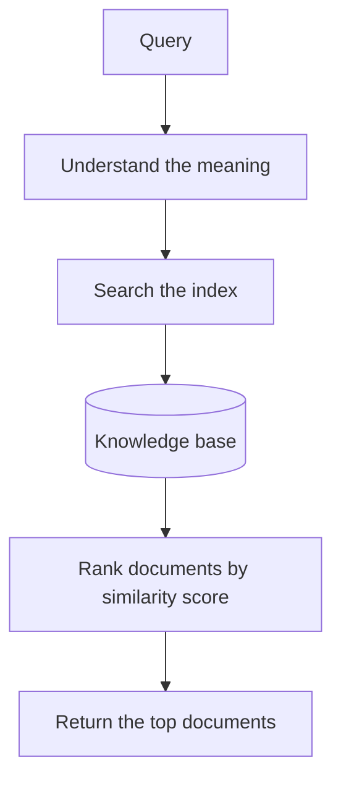
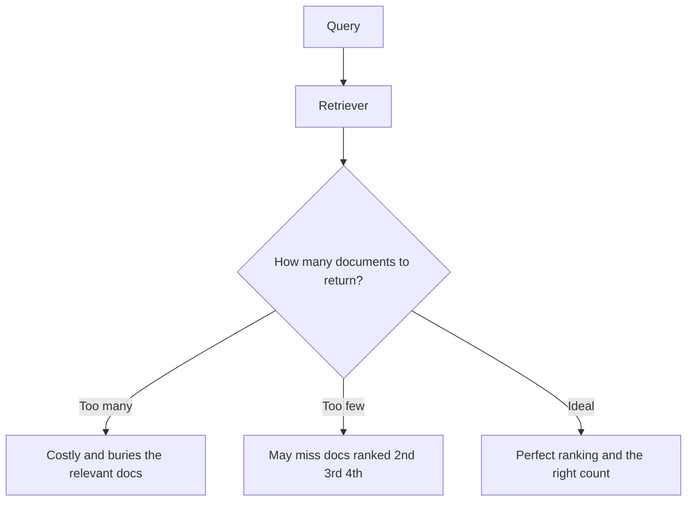

*Final part of a 3-part series on Retrieval-Augmented Generation. Part 1 covered what RAG is; part 2 looked inside the LLM. Now we get to the component that does the actual work: the retriever.*

## The retriever's job

By now the purpose of the retriever should be clear: it needs to supply useful information to the LLM that may not have been available when the model was trained. The question is how it actually does that.

Start with an analogy. Imagine walking into a library to answer a question like *"how do I make New York-style pizza at home?"* The library has a huge collection of books on every topic. To help you navigate it, books are organized into sections and shelves by subject, genre, author, and so on.

If you share your question with the librarian, they can help you find the sections — or even the specific books — that best match it. They understand the *meaning* of your question and use that to decide which shelves are worth searching, and eventually find the relevant books.

A retriever has similar parts. Where the library has a collection of books, the retriever has a **knowledge base** of documents. And just as a library is organized, a retriever builds an **index** of the documents in the knowledge base — a structure that arranges the material and makes it searchable.

## Retrieval, step by step

The next step is actually retrieving the relevant information. In the library, you ask the librarian directly. They understand the meaning of your question and know to look in the cooking, Italian-cuisine, or New York sections. That ability to understand the meaning is what lets them target the right shelves.

A retriever does the same thing:

1. **Understand the query.** It processes the question to capture its underlying meaning.
2. **Search the index.** It uses that understanding to search the document index.
3. **Return matches.** It returns the documents from the knowledge base that it determines are most relevant.

When the search is done, the retriever **ranks** the documents by relevance. Each document gets a numeric score quantifying how relevant it is — usually some measure of **similarity** between the text of the query and the text of the document. The documents with the highest scores are the ones returned.

There are many ways to compute that similarity score, and they're a big part of what you learn when going deeper into RAG.

## The tradeoff: how much to return

A well-designed retriever has to return relevant documents — but it also has to *exclude irrelevant ones*.

Ask about New York-style pizza at home and imagine the retriever responds with *every document in the knowledge base*. Technically you now have all the relevant documents — but they're buried in a mountain of irrelevant information. As we saw in part 2, that also makes your prompt expensive and can exhaust the model's context window.

On the other hand, if you only return the single top-ranked document, you might miss valuable relevant information sitting at rank 2, 3, or 4.

In an ideal world the retriever would rank documents perfectly and pick exactly the right number to return. In reality, retrievers sometimes rank relevant documents too low and irrelevant documents too high, which makes deciding *how many* documents to return genuinely hard.

The upshot: optimizing a retriever means watching it over time and experimenting with different settings — which is exactly the kind of iterative work that shows up throughout RAG development.

## This isn't new — it's just new to LLMs

Worth noting: plenty of familiar software does tasks very similar to a retriever. A **web search engine** retrieves web pages relevant to a search. A **relational database** retrieves rows and tables matching a SQL query.

The field of **information retrieval** was already mature long before LLMs were first developed. But its ideas are foundational to how retrievers and RAG systems are designed today — the LLM part is new; the retrieval part is a well-trodden problem.

In theory there are many ways to implement a retriever. Since most companies already keep their data in traditional relational databases, it would be nice to keep the data there and retrieve from it to power a RAG system. But **at scale, most retrievers are built on vector databases** — a specialized kind of database optimized for quickly finding the documents in your knowledge base that best match a search request.

*Why* vector databases work — embeddings, vectors, and similarity search — is the natural next topic, and the place most RAG learning paths go from here.

## Series wrap-up

Three parts, one idea. RAG is a way to give an LLM information it doesn't have:

- **Part 1** — LLMs can't know your private or fresh data, and they'll confidently make things up. RAG augments the prompt with retrieved context to fix that.
- **Part 2** — LLMs predict the next token, one at a time, autoregressively. That design makes hallucination natural and makes the context window a hard constraint — which is why retrieval must be selective.
- **Part 3** — the retriever understands the query, searches an index over a knowledge base, ranks documents by similarity, and returns the best few. Getting *how many* and *which ones* right is the craft.

From here, the natural next steps are embeddings and vector search, chunking strategies, re-ranking, and evaluating retrieval quality. But you now have the mental model that everything else hangs on.

*This was the final post in the “RAG from Scratch” series.*
