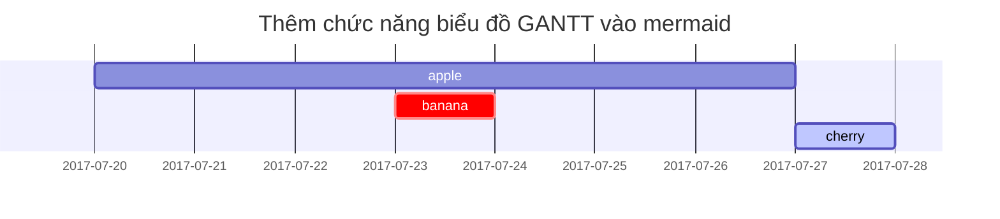

## Tiêu đề

<!-- markdownlint-capture -->
<!-- markdownlint-disable -->
# H1 — tiêu đề
{: .mt-4 .mb-0 }

## H2 — tiêu đề
{: data-toc-skip='' .mt-4 .mb-0 }

### H3 — tiêu đề
{: data-toc-skip='' .mt-4 .mb-0 }

#### H4 — tiêu đề
{: data-toc-skip='' .mt-4 }
<!-- markdownlint-restore -->

## Đoạn văn

Quisque egestas convallis ipsum, ut sollicitudin risus tincidunt a. Maecenas interdum malesuada egestas. Duis consectetur porta risus, sit amet vulputate urna facilisis ac. Phasellus semper dui non purus ultrices sodales. Aliquam ante lorem, ornare a feugiat ac, finibus nec mauris. Vivamus ut tristique nisi. Sed vel leo vulputate, efficitur risus non, posuere mi. Nullam tincidunt bibendum rutrum. Proin commodo ornare sapien. Vivamus interdum diam sed sapien blandit, sit amet aliquam risus mattis. Nullam arcu turpis, mollis quis laoreet at, placerat id nibh. Suspendisse venenatis eros eros.

## Danh sách

### Danh sách có thứ tự

1. Thứ nhất
2. Thứ hai
3. Thứ ba

### Danh sách không thứ tự

- Chương
  - Phần
    - Đoạn

### Danh sách việc cần làm

- [ ] Công việc
  - [x] Bước 1
  - [x] Bước 2
  - [ ] Bước 3

### Danh sách mô tả

Mặt trời
: ngôi sao mà trái đất quay quanh

Mặt trăng
: vệ tinh tự nhiên của trái đất, có thể nhìn thấy nhờ ánh sáng phản chiếu từ mặt trời

## Trích dẫn khối

> Dòng này thể hiện _trích dẫn khối_.

## Lời nhắc

<!-- markdownlint-capture -->
<!-- markdownlint-disable -->
> Ví dụ về lời nhắc loại `tip`.
{: .prompt-tip }

> Ví dụ về lời nhắc loại `info`.
{: .prompt-info }

> Ví dụ về lời nhắc loại `warning`.
{: .prompt-warning }

> Ví dụ về lời nhắc loại `danger`.
{: .prompt-danger }
<!-- markdownlint-restore -->

## Bảng

| Công ty                        | Liên hệ          | Quốc gia |
| :----------------------------- | :--------------- | -------: |
| Alfreds Futterkiste            | Maria Anders     | Đức     |
| Island Trading                 | Helen Bennett    | Anh      |
| Magazzini Alimentari Riuniti   | Giovanni Rovelli | Ý       |

## Liên kết

<http://127.0.0.1:4000>

## Chú thích cuối trang

Nhấp vào móc sẽ định vị chú thích cuối trang[^footnote], và đây là một chú thích cuối trang khác[^fn-nth-2].

## Mã nội dòng

Đây là ví dụ về `Mã Nội Dòng`.

## Đường dẫn file

Đây là `/path/to/the/file.extend`{: .filepath}.

## Khối mã

### Thông thường

```text
Đây là một đoạn mã thông thường, không có tô sáng cú pháp và số dòng.
```

### Ngôn ngữ cụ thể

```bash
if [ $? -ne 0 ]; then
  echo "Lệnh không thành công.";
  #thực hiện hành động cần thiết / thoát
fi;
```

### Tên file cụ thể

```sass
@import
  "colors/light-typography",
  "colors/dark-typography";
```

{: file='_sass/jekyll-theme-chirpy.scss'}

## Toán học

Toán học được hỗ trợ bởi [**MathJax**](https://www.mathjax.org/):

$$
\begin{equation}
  \sum_{n=1}^\infty 1/n^2 = \frac{\pi^2}{6}
  \label{eq:series}
\end{equation}
$$

Chúng ta có thể tham chiếu phương trình như \eqref{eq:series}.

Khi $a \ne 0$, có hai nghiệm cho $ax^2 + bx + c = 0$ và chúng là

$$ x = {-b \pm \sqrt{b^2-4ac} \over 2a} $$

## Mermaid SVG



## Hình ảnh

### Mặc định (có chú thích)

{: width="972" height="589" }
_Chiều rộng toàn màn hình và căn giữa_

### Căn trái

{: width="972" height="589" .w-75 .normal}

### Nổi về bên trái

{: width="972" height="589" .w-50 .left}
Praesent maximus aliquam sapien. Sed vel neque in dolor pulvinar auctor. Maecenas pharetra, sem sit amet interdum posuere, tellus lacus eleifend magna, ac lobortis felis ipsum id sapien. Proin ornare rutrum metus, ac convallis diam volutpat sit amet. Phasellus volutpat, elit sit amet tincidunt mollis, felis mi scelerisque mauris, ut facilisis leo magna accumsan sapien. In rutrum vehicula nisl eget tempor. Nullam maximus ullamcorper libero non maximus. Integer ultricies velit id convallis varius. Praesent eu nisl eu urna finibus ultrices id nec ex. Mauris ac mattis quam. Fusce aliquam est nec sapien bibendum, vitae malesuada ligula condimentum.

### Nổi về bên phải

{: width="972" height="589" .w-50 .right}
Praesent maximus aliquam sapien. Sed vel neque in dolor pulvinar auctor. Maecenas pharetra, sem sit amet interdum posuere, tellus lacus eleifend magna, ac lobortis felis ipsum id sapien. Proin ornare rutrum metus, ac convallis diam volutpat sit amet. Phasellus volutpat, elit sit amet tincidunt mollis, felis mi scelerisque mauris, ut facilisis leo magna accumsan sapien. In rutrum vehicula nisl eget tempor. Nullam maximus ullamcorper libero non maximus. Integer ultricies velit id convallis varius. Praesent eu nisl eu urna finibus ultrices id nec ex. Mauris ac mattis quam. Fusce aliquam est nec sapien bibendum, vitae malesuada ligula condimentum.

### Chế độ Tối/Sáng & Đổ bóng

Hình ảnh bên dưới sẽ chuyển đổi chế độ tối/sáng dựa trên tùy chọn giao diện, lưu ý nó có bóng.

{: .light .w-75 .shadow .rounded-10 w='1212' h='668' }
{: .dark .w-75 .shadow .rounded-10 w='1212' h='668' }

## Video



## Chú thích cuối trang đảo ngược

[^footnote]: Nguồn chú thích cuối trang
[^fn-nth-2]: Nguồn chú thích cuối trang thứ 2
